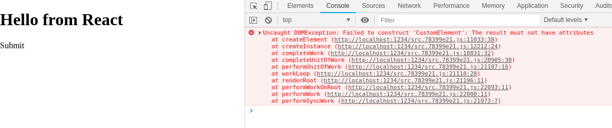

# 01 Simple Button

In this sample we are going to use a [wired-button](https://www.webcomponents.org/element/wired-button) from [wired-elements](https://www.webcomponents.org/element/wired-elements) web component in React

# Steps

- Copy files from previous sample.

- Install dependencies:

```bash
npm i
```

- Install `rimraf` to clean `dist` folder:

```bash
npm i rimraf -D
```

_./package.json_

```diff
{
  ...
  "scripts": {
-   "start": "parcel ./src/index.html --open"
+   "start": "rimraf dist && parcel ./src/index.html --open"
  },
  ...
}
```

- If we check [web components browser compatibility](https://caniuse.com/#search=web%20components) we could see that we need some polyfills to work with it nowadays. So we need to install [web components polyfills](https://github.com/WebComponents/webcomponentsjs)

```bash
npm i @webcomponents/webcomponentsjs -P
```

- In order to split vendor dependencies from app, let's add `vendor` file:

_./src/vendor.js_

```javascript
import('react');
import('react-dom');
import('@webcomponents/webcomponentsjs');

```

> NOTE: with import() we are splitting lib to other file but we need to import webcomponents polyfill on index.jsx file.

- Add previous file to html:

_./src/index.html_

```diff
...
+ <script src="./vendor.js"></script>
<script src="./index.jsx"></script>

</html>
```

- Install [`wired-elements`](https://www.webcomponents.org/element/wired-elements) web component from official web components site:

```bash
npm i wired-elements@0.7.2 -P -E
```

> NOTE: Important here to install 0.7.2 version or previous because lastest 0.8.x version is not working on Chrome



- Add it to `vendor` file:

_./src/vendor.js_

```diff
import('react');
import('react-dom');
import('@webcomponents/webcomponentsjs');
+ import('wired-elements');

```

- Let's use it:

_./src/index.js_

```diff
import React from 'react';
import ReactDOM from 'react-dom';
+ import '@webcomponents/webcomponentsjs';
+ import 'wired-elements';

- const HelloComponent = () => <h1>Hello from React</h1>;
+ const HelloComponent = () => (
+   <div>
+    <h1>Hello from React</h1>
+    <wired-button>Submit</wired-button>
+   </div>
+ );

ReactDOM.render(<HelloComponent />, document.getElementById('root'));

```

- This button has [some properties](https://www.webcomponents.org/element/wired-button/elements/wired-button) like disabled or elevation:

_./src/index.js_

```diff
...
const HelloComponent = () => (
  <div>
    <h1>Hello from React</h1>
-   <wired-button>Submit</wired-button>
+   <wired-button elevation={2}>Submit</wired-button>
+   <wired-button disabled={true}>Cancel</wired-button>
  </div>
);
...
```