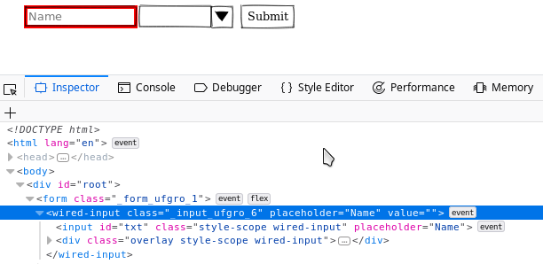

# 03 Styling web component

In this sample we are going to add styles to previous form.

# Steps

- Copy files from previous sample.

- Install dependencies:

```bash
npm i
```

- As a normal HTML elements, we can add styles to web components:

_./src/form.css_

```css
.form {
  display: flex;
  align-items: center;
}

.form > .input {
  margin-left: 2rem;
}
```

- Add [`css-modules`](https://parceljs.org/transforms.html#postcss):

```bash
npm i postcss-modules -D
```

- Add config file:

_./.postcssrc_

```json
{
  "modules": true
}
```

- Let's apply styles to `form` and `input`:

_./src/form.jsx_

```diff
import React, { Component } from 'react';
+ import styles from './form.css';

export class Form extends Component {
  ...

  render() {
    return (
-     <form>
+     <form className={styles.form}>
        <wired-input
+         class={styles.input}
          ref={this.nameRef}
          placeholder="Name"
          value={this.props.user.name}
        />
...
      </form>
    );
  }
}
```

> NOTE: We have to access to `class` instead of `className` property for web components.

- If we need to add some background style:

_./src/form.css_

```diff
.form {
  display: flex;
  align-items: center;
}

.form > .input {
  margin-left: 2rem;
+ background-color: red;
}
```

- We could see that color was apply to `wired-input` instead of interal `input`:



- A workaround could be:

_./src/form.css_

```diff
.form {
  display: flex;
  align-items: center;
}

.form > .input {
  margin-left: 2rem;
- background-color: red;
}

+ .form > .input > input {
+   background-color: red;
+   color: white;
+ }
```

- But it doesn't work because we are attaching to [Shadow DOM](https://developer.mozilla.org/en-US/docs/Web/Web_Components/Using_shadow_DOM). That means we have an isolated DOM with scoped CSS styles.

- However [wired-combo](https://www.webcomponents.org/element/wired-combo) is exposing some custom css variables to change some styles:

_./src/form.css_

```diff
...

- .form > .input > input {
-   background-color: red;
-   color: white;
- }

+ .form > .select {
+   --wired-combo-item-hover-bg: white;
+   --wired-combo-item-selected-bg: gray;
+   --wired-combo-popup-bg: #dedede;
+ }
```

_./src/form.jsx_

```diff
...

  <wired-combo
+   class={styles.select}
    ref={this.countryIdRef}
    selected={this.props.user.countryId}
  >
    {this.props.countries.map(country => (
      <wired-item
        key={country.id}
        value={country.id}
        text={country.name}
      />
    ))}
  </wired-combo>
...
```

- Other way to replace styles from outside is when web component has defined a specific class name. For example the `wired-button` implementation has:

```css
...
  :host(.disabled) {
    opacity: 0.6 !important;
    background: rgba(0, 0, 0, 0.07);
    cursor: default;
    pointer-events: none;
  }

  :host(:focus) path {
    stroke-width: 1.5;
  }
...
```

- We could replace `focus` styles like:

_./src/form.css_

```diff
.form > .select {
  margin-left: 2rem;
  --wired-combo-item-hover-bg: white;
  --wired-combo-item-selected-bg: gray;
  --wired-combo-popup-bg: #dedede;
}

+ .form > .button {
+   margin-left: 2rem;
+ }

+ .form > .button:focus {
+   background-color: lightgreen;
+ }

```

_./src/form.jsx_

```diff
...
-   <wired-button ref={this.submitRef}>Submit</wired-button>
+   <wired-button class={styles.button} ref={this.submitRef}>
+     Submit
+   </wired-button>
...
```

- Even, we could replace `disabled` class:

_./src/form.css_

```diff
.form > .button {
  margin-left: 2rem;
}

.form > .button:focus {
  background-color: lightgreen;
}

+ .form > .button:global(.disabled) {
+   background-color: tomato;
+ }
```

> NOTE: We have to add special `:global` key to avoid rename `disabled` class name with unique identifier

_./src/form.jsx_

```diff
...
-   <wired-button class={styles.button} ref={this.submitRef}>
+   <wired-button
+     class={styles.button}
+     ref={this.submitRef}
+     disabled={true}
+   >
      Submit
    </wired-button>
...
```