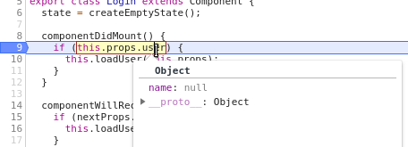
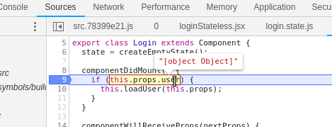

# 01 Props and State

In this sample we are going to create a Login web component which it has props and internal state.

# Steps

- Copy files from previous sample.

- Install dependencies:

```bash
npm i
```

- Copy `.babelrc` and `.postcssrc` files to root path.

- Let's create the stateless component:

_./src/login/loginStateless.jsx_

```javascript
import React from 'react';
import styles from './loginStateless.css';

export const LoginStateless = props => (
  <form className={styles.login}>
    <input
      type="text"
      value={props.user.name}
      name="name"
      placeholder="Name"
      onChange={changeHandler(props)}
    />
    <input
      type="password"
      value={props.user.password}
      name="password"
      placeholder="Password"
      onChange={changeHandler(props)}
    />
    <button type="button" onClick={props.onLogin}>
      Login
    </button>
  </form>
);

const changeHandler = props => event => {
  const fieldName = event.target.name;
  const value = event.target.value;
  props.onFieldChange(fieldName, value);
};
```

_./src/login/loginStateless.css_

```css
.login {
  display: flex;
  flex-direction: column;
}
```

- Let's create the stateful component:

_./src/login/login.jsx_

```javascript
import React, { Component } from 'react';
import { LoginStateless } from './loginStateless';
import { createEmptyState } from './login.state';

export class Login extends Component {
  state = createEmptyState();

  componentDidMount() {
    if (this.props.user) {
      this.loadUser(this.props);
    }
  }

  componentWillReceiveProps(nextProps) {
    if (nextProps.user.name !== this.props.user.name) {
      this.loadUser(nextProps);
    }
  }

  loadUser = props => {
    this.setState({
      user: props.user,
    });
  };

  onFieldChange = (fieldName, value) => {
    this.setState({
      user: {
        ...this.state.user,
        [fieldName]: value,
      },
    });

    if (this.props.onChange) {
      this.props.onChange(fieldName, value);
    }
  };

  onLogin = () => {
    // Do a login API request
    console.log('Run login API request');
  };

  render() {
    return (
      <LoginStateless
        user={this.state.user}
        onFieldChange={this.onFieldChange}
        onLogin={this.onLogin}
      />
    );
  }
}
```

_./src/login/index.js_

```javascript
export * from './login';
```

- As we see on Login component, we need to expose two properties:

  - `user`: Object with { name, password } fields.
  - `onChange`: Callback to execute after some field change.

- Let's update the web component. Before declare previous properties, we are going to start with a simple `userName` property:

_./src/index.jsx_

```diff
import React from 'react';
import ReactDOM from 'react-dom';
+ import { Login } from './login';

const root = document.createElement('span');

- class HelloComponent extends HTMLElement {
+ class LoginComponent extends HTMLElement {
  constructor() {
    super();

    this.attachShadow({ mode: 'open' }).appendChild(root);
-   ReactDOM.render(<h1>Hello from web component and React</h1>, root);
+   ReactDOM.render(<Login user={{ name: this.userName }} />, root);
  }

+ set userName(value) {
+   this.setAttribute('userName', value);
+ }

+ get userName() {
+   return this.getAttribute('userName');
+ }
}

- customElements.define('hello-component', HelloComponent);
+ customElements.define('login-component', LoginComponent);
```

- Let's update `playground` folder:

_./playground/src/index.jsx_

```diff
import React from 'react';
import ReactDOM from 'react-dom';
import '@webcomponents/webcomponentsjs';
import 'my-web-component';

- ReactDOM.render(<hello-component />, document.getElementById('root'));
+ ReactDOM.render(
+   <login-component userName="Test userName" />,
+   document.getElementById('root')
+ );
```

- If we run like that, we will get userName equals null:



- The reason is, we are render React Login component only when Login web component is mounted, so for future re-renders, React is not listening on that. We have to use [connectedCallback](https://developer.mozilla.org/en-US/docs/Web/Web_Components/Using_custom_elements#Using_the_lifecycle_callbacks):

_./src/index.jsx_

```diff

  constructor() {
    super();

-   this.attachShadow({ mode: 'open' }).appendChild(root);
+   this.attachShadow({ mode: 'open' });
-   ReactDOM.render(<Login user={{ name: this.userName }} />, root);
  }

+ connectedCallback() {
+   this.shadowRoot.appendChild(root);
+   ReactDOM.render(<Login user={{ name: this.userName }} />, root);
  }

  set userName(value) {
    this.setAttribute('userName', value);
  }
```

- Let's try to replace `userName` by `user`:

_./src/index.jsx_

```diff
import React from 'react';
import ReactDOM from 'react-dom';
import { Login } from './login';

const root = document.createElement('span');

class LoginComponent extends HTMLElement {
  constructor() {
    super();
  
    this.attachShadow({ mode: 'open' });
  }
  
  connectedCallback() {
    this.shadowRoot.appendChild(root);
-   ReactDOM.render(<Login user={{ name: this.userName }} />, root);
+   ReactDOM.render(<Login user={this.user} />, root);
  }

- set userName(value) {
+ set user(value) {
-   this.setAttribute('userName', value);
+   this.setAttribute('user', value);
  }

- get userName() {
+ get user() {
-   return this.getAttribute('userName');
+   return this.getAttribute('user');
  }
}

customElements.define('login-component', LoginComponent);
```

_./playground/src/index.jsx_

```diff
import React from 'react';
import ReactDOM from 'react-dom';
import '@webcomponents/webcomponentsjs';
import 'my-web-component';

+ const user = {
+   name: 'test',
+   password: 'pass',
+ };

ReactDOM.render(
- <login-component userName="Test userName" />,
+ <login-component user={user} />,
  document.getElementById('root')
);

```

- If we run this, `user` has `[object Object]` value because [getAttribute](https://developer.mozilla.org/en-US/docs/Web/API/Element/getAttribute) returns the `string` value from element attribute and [setAttribute](https://developer.mozilla.org/en-US/docs/Web/API/Element/setAttribute) will convert automatically into a string for any non-string value specified.



- For primitive data this is fine, but the system breaks down when passing rich data, like objects or arrays. In these instances you end up with stringified values like `user="[object Object]"` which can't actually be used.