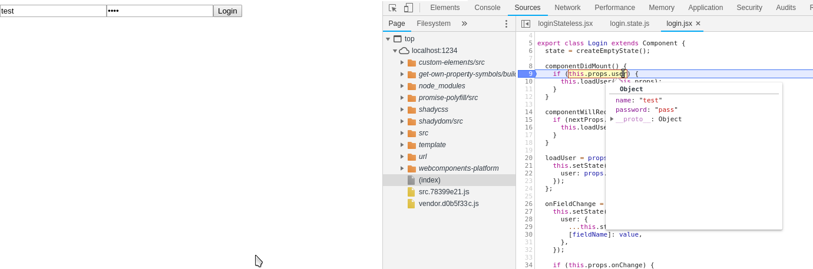

# 01 Using previous React web components

In this sample we are going to use previous React web component in a Preact app.

# Steps

- Copy files from previous sample.

- Install dependencies:

```bash
npm i
```

- According to [custom-elements-everywhere](https://custom-elements-everywhere.com/), Preact is able to pass `object` and `array` as properties to web components, but it has not 100% support with it.

- To know limitations, we are going to install [`Preact`](https://github.com/developit/preact) in `playground` folder and render the `Login` web component created with React:

```bash
npm run build
```

```bash
cd ./playground
```

```bash
npm uninstall react react-dom -P
npm i preact -P
npm i @babel/plugin-transform-react-jsx -D
```

- Update `.babelrc`:

_./playground/.babelrc_

```diff
{
  "presets": [
    "@babel/preset-react",
    [
      "@babel/preset-env",
      {
        "useBuiltIns": "entry"
      }
    ]
  ],
- "plugins": ["@babel/plugin-proposal-class-properties"]
+ "plugins": [
+   "@babel/plugin-proposal-class-properties",
+   ["@babel/plugin-transform-react-jsx", { "pragma": "h" }]
+ ]
}

```

- Update `vendor`:

_./playground/src/vendor.js_

```diff
- import('react');
- import('react-dom');
+ import('preact');
import('@webcomponents/webcomponentsjs');
import('my-web-component');
```

- Finally, update `index` file:

_./playground/src/index.jsx_

```diff
- import React from 'react';
- import ReactDOM from 'react-dom';
+ import {h, render} from 'preact';
import '@webcomponents/webcomponentsjs';
import 'my-web-component';

const user = {
  name: 'test',
  password: 'pass',
};

- ReactDOM.render(
+ render(
- <login-component user={JSON.stringify(user)} />,
+ <login-component user={user} />,
  document.getElementById('root')
);

```

- Only with these changes, we could see now:



- That means Preact is handling the `stringify` functionality for us. Some similar behaviour we have for arrays.